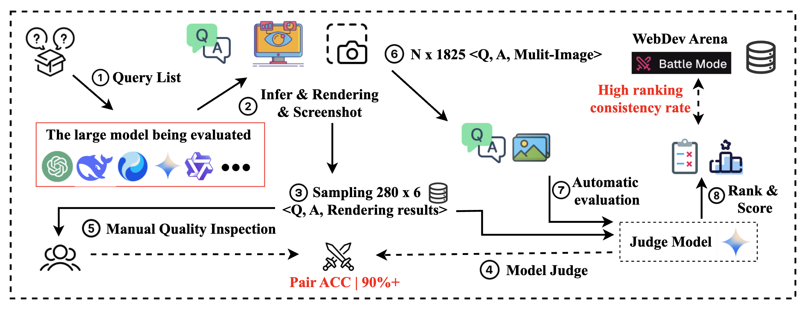
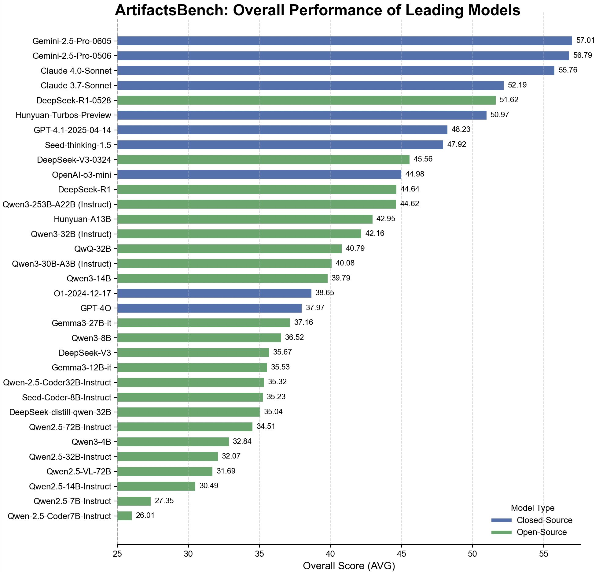

<div align='center'>

# ArtifactsBench: Bridging the Visual-Interactive Gap in LLM Code Generation Evaluation

**Tencent Hunyuan Team**

---

<p align="center">
    <a href="https://arxiv.org/abs/xxxx.xxxxx">📖 Paper</a> •
    <a href="https://artifactsbenchmark.github.io/">🏠 Home Page</a> •
    <a href="https://huggingface.co/datasets/tencent/ArtifactsBenchmark/">💻 Data </a> •
    <a href="https://artifactsbenchmark.github.io/leaderboard.html">🏆 Leaderboard</a> •
    <a href="#citation"><b>📜 Citation</b></a>
</p>

<div align="center">
  
</div>
<p align="center">
  <i>Figure 1: Automation level versus human–alignment across evaluation frameworks. The red star marks the fully manual WebDev Arena (100% human effort), while the blue bubble denotes our checklist-guided MLLM evaluation, ArtifactsBench, which achieves 94.4% agreement with human votes with 100% automation.</i>
</p>
</div>

## Introduction

The generative capabilities of Large Language Models (LLMs) are rapidly expanding from static code to dynamic, interactive visual artifacts. This progress is bottlenecked by a critical evaluation gap: established benchmarks focus on algorithmic correctness and are blind to the visual fidelity and interactive integrity that define modern user experiences.

To bridge this gap, we introduce **ArtifactsBench**, a new benchmark and paradigm for the automated, multimodal evaluation of visual code generation. Our framework programmatically renders each generated artifact and captures its dynamic behavior, which is then assessed by an MLLM-as-Judge guided by a fine-grained, per-task checklist to ensure holistic and reproducible scoring.

ArtifactsBench is open-sourced, including the benchmark with **1,825 diverse tasks**, the evaluation harness, and baseline results, to provide the community with a scalable and accurate tool to accelerate the development of user-centric generative models.

## Core Features

-   **A Diverse and Hierarchical Benchmark Suite:** ArtifactsBench comprises a rich set of tasks derived from real-world applications, including component-based web development, SVG-based data visualization, and interactive mini-games. Tasks are stratified by complexity (simple, medium, hard) to robustly measure model capabilities across a meaningful difficulty gradient.
-   **A Novel Multimodal and Automated Evaluation Pipeline:** We propose a new evaluation strategy that synergizes automated interaction with Multimodal Large Language Model (MLLM)-based assessment. Our framework programmatically interacts with the generated artifacts (e.g., clicking buttons, dispatching events) and captures visual states (e.g., screenshots, GIFs). An MLLM-as-Judge then evaluates these visual and textual traces against fine-grained, per-task criteria.
-   **In-depth Analysis and Gold-Standard Validation:** We conducted a large-scale evaluation of over 30 prominent LLMs. Our automated evaluation achieves a striking **94.4% ranking consistency with WebDev Arena**, the gold-standard for human preference, validating our approach as a highly reliable proxy for human-perceived quality.

## Benchmark Comparison

ArtifactsBench is the first to offer high-granularity evaluation (GR), strong human-judgment consistency (CHA), automated assessment (AF), and direct visual evaluation (VE), addressing critical gaps in prior work.

| **Benchmark**                  | **Data Size** | **Data Source**     | **Primary Task**                   | **GR**                               | **CHA**                              | **AF**       | **VE**       |
| ------------------------------ | ------------- | ------------------- | ---------------------------------- | ------------------------------------ | ------------------------------------ | :----------: | :----------: |
| Humaneval                      | 164           | Human-Written       | Algorithmic Tasks                  | <font color='gray'>Low</font>        | <font color='gray'>High</font>       |      ✓       |      ✗       |
| SWE-Bench                      | 2,294         | GitHub Issues       | Repository-level Bug Fixing        | <font color='gray'>Low</font>        | <font color='gray'>High</font>       |      ✓       |      ✗       |
| WebBench                       | 1,000         | Human-Written       | Web Task Automation                | <font color='orange'>Mid</font>      | <font color='orange'>Mid</font>      |      ✓       |      ✗       |
| WebGen-Bench                   | 101           | Human & GPT-4       | Web Page Generation                | <font color='orange'>Mid</font>      | <font color='orange'>Mid</font>      |      ✓       |      ✓       |
| WebChoreArena                  | 532           | Curated Tasks       | Web Automation (No UI)             | <font color='orange'>Mid</font>      | <font color='orange'>Mid</font>      |      ✓       |      ✗       |
| FullFront                      | 1,800 QA      | Model-Synthesized   | Web Comprehension/Generation       | <font color='orange'>Mid</font>      | <font color='orange'>Mid</font>      |      ✓       |      ✓       |
| WebDev Arena                   | N/A           | User-Prompts        | Web Design (Human Vote)            | <font color='gray'>Low</font>        | <font color='gray'>High</font>       |      ✗       |      ✓       |
| **ArtifactsBench (Ours)**      | **1,825**     | **Self-Constructed**  | **Interactive Visual Artifacts**   | <font color='green'><b>High</b></font> | <font color='green'><b>High</b></font> |      ✓       |      ✓       |

## Dataset Distribution

<div align="center">
  
</div>
<p align="center">
  <i>Figure 2: An overview of the ArtifactsBench dataset, illustrating the distribution of tasks across nine primary categories.</i>
</p>

## Evaluation Pipeline

Our evaluation process is designed to ensure objectivity and high consistency with human expert judgment.

<div align="center">
  
</div>
<p align="center">
  <i>Figure 3: The ArtifactsBench evaluation pipeline. The process hinges on a two-stage evaluation: (Step 5) we first validate our MLLM-as-Judge by confirming its high pairwise scoring agreement with human experts. (Step 6) Once its reliability is established, the automated judge is deployed at scale to evaluate all model outputs across the entire benchmark.</i>
</p>

## Quick Start

<details>
<summary><b>Environment Setup, Data Format, and Evaluation Instructions</b></summary>

### Environment Setup

```bash
pip install vllm==0.8.3
pip install pytest-playwright
playwright install
playwright install-deps
pip install transformers
pip install requests
pip install tqdm
```

### Data format
You can use your own model to perform inference based on the "question" field in the `dataset/artifacts_bench.json` file, and save the results in the "answer" field.
```JSON
{
    "index": "unique identifier in the dataset that corresponds one-to-one with 'question'",
    "question": "each 'question' in ArtifactsBench",
    "answer": "The answer inferred by your model based on the 'question'"
}
```

### Evaluation Using Gemini

```bash
api_key=xxx
model_marker=xxx
api_url=xxx
screenshots_count=3
path_with_index=xxx
save_path=xxx
screenshots_dir=xxx
tokenizer_dir=xxx
num_processes=16
python3 src/infer_gemini.py \
    $path_with_index \
    $save_path \
    $screenshots_dir \
    $screenshots_count \
    $api_key \
    $model_marker \
    $api_url \
    $tokenizer_dir \
    --num_processes $num_processes
```

#### Parameters Description
* **api\_key**: Your API key for accessing the Gemini model.
* **model\_marker**: The specific marker for the model to use in Gemini.
* **api\_url**: The URL endpoint for making the POST request to the server.
* **count**: The number of screenshots to feed into Gemini.
* **path\_with\_index**: The input file. Each entry in this file should include an 'index', 'question', and 'answer'.
* **save\_path**: The path where the results will be saved. Each entry will include two additional fields: `gemini_reason` (the explanation from Gemini) and `gemini_ans` (the score provided by Gemini).
* **screenshots\_dir**: The directory where the screenshots are stored.
* **tokenizer\_dir**: The directory for the tokenizer model, to prevent an excessive number of tokens.
* **num\_processes**: The number of processes to use for inference. For example, `16` processes.

### Evaluation Using Qwen2.5-VL-72B

```bash
# Deploy Qwen2.5-VL-72B-Instruct using vllm
MODEL_DIR="/xxx/Qwen2.5-VL-72B-Instruct"
HOST_IP=$(hostname -i)
model_name=$(basename $MODEL_DIR)
nohup python3 -m vllm.entrypoints.openai.api_server \
    --enforce-eager --swap-space 50 --disable-log-requests \
    --dtype float16 --trust-remote-code \
    --model ${MODEL_DIR} --served-model-name ${model_name} \
    --gpu-memory-utilization 0.9 --port 8088 \
    --max-model-len 32768 --max-seq-len 32768 \
    --limit-mm-per-prompt "image=5"\
    --tensor-parallel-size 8 \
    --seed 1024 > /root/log.ds_server 2> /root/err.ds_server &
sleep 10m

# Evaluate the answers with Qwen2.5-VL-72B-Instruct.
screenshots_count=3
path_with_index=xxx
save_path=xxx
screenshots_dir=xxx
tokenizer_dir=$MODEL_DIR
ip_file_path=$HOST_IP # ip or ip_list_file
num_processes=16
python3 src/infer_qvl.py \
  $path_with_index \
  $save_path \
  $screenshots_dir \
  $screenshots_count \
  $model_name \
  $tokenizer_dir \
  $ip_file_path \
  --num_processes $num_processes
```

#### Parameters Description
* **MODEL\_DIR**: The directory where the `Qwen2.5-VL-72B-Instruct` model is stored.
* **HOST\_IP**: The IP address of the host machine (obtained using `hostname -i`).
* **model\_name**: The name of the model (derived from the basename of `MODEL_DIR`).
* **screenshots\_count**: The number of screenshots to feed into Qwen2.5-VL-72B.
* **path\_with\_index**: The input file. Each entry should include an `index`, `question`, and `answer`.
* **save\_path**: The path where the results will be saved. Each entry will include two additional fields: `qvl_reason` (the explanation from Qwen2.5-VL-72B) and `qvl_ans` (the score provided by Qwen2.5-VL-72B).
* **screenshots\_dir**: The directory where the screenshots are stored.
* **tokenizer\_dir**: The directory for the tokenizer model, to prevent an excessive number of tokens.
* **ip\_file\_path**: The path to the file containing the IP addresses or IP list of the machines for distributed processing (e.g., `pssh.hosts`).
* **num\_processes**: The number of processes to use for inference (e.g., `16` processes).

</details>

## 🏆 Leaderboard

The following are the main results on ArtifactsBench, scored by the `Gemini-2.5-Pro-0506` referee. A higher score indicates better overall capability in generating visual and interactive artifacts.

<div align="center">
  
</div>

| **Model**                 | **AVG** | **SV**  | **MMD** | **HD**  | **II**  | **GAME** | **SVG** | **WEB** | **SI**  | **MS**  |
| ------------------------ | :-----: | :-----: | :-----: | :-----: | :-----: | :------: | :-----: | :-----: | :-----: | :-----: |
| **_Closed-Source LLMs_** |         |         |         |         |         |          |         |         |         |         |
| Gemini-2.5-Pro-0605      | **57.01** | 59.99   | 56.35   | 58.13   | 54.87   | 55.21    | 61.78   | 58.30   | 55.03   | 55.03   |
| Gemini-2.5-Pro-0506      | **56.79** | 59.02   | 57.69   | 57.99   | 54.70   | 56.65    | 62.37   | 57.28   | 55.26   | 53.04   |
| Claude 4.0-Sonnet        | **55.76** | 57.14   | 59.18   | 57.93   | 53.04   | 57.22    | 56.98   | 55.79   | 56.67   | 53.20   |
| Claude 3.7-Sonnet        | **52.19** | 52.73   | 53.54   | 53.48   | 50.83   | 52.24    | 51.63   | 53.64   | 52.14   | 50.27   |
| Hunyuan-Turbos-Preview   | **50.97** | 50.58   | 53.27   | 53.08   | 49.35   | 51.61    | 51.37   | 52.31   | 50.74   | 49.92   |
| GPT-4.1-2025-04-14       | **48.23** | 47.90   | 48.68   | 49.61   | 47.39   | 50.43    | 48.75   | 48.51   | 46.88   | 42.81   |
| Seed-thinking-1.5        | **47.92** | 49.16   | 48.36   | 49.84   | 45.90   | 47.59    | 47.86   | 49.61   | 49.81   | 45.81   |
| OpenAI-o3-mini           | **44.98** | 46.49   | 45.11   | 46.04   | 43.45   | 45.43    | 46.82   | 45.18   | 43.91   | 41.73   |
| O1-2024-12-17            | **38.65** | 39.51   | 38.35   | 39.90   | 37.38   | 38.96    | 38.58   | 39.01   | 38.12   | 36.20   |
| GPT-4o                   | **37.97** | 40.60   | 37.74   | 40.32   | 35.04   | 36.96    | 39.54   | 39.27   | 35.73   | 35.83   |
| **_Open-Source LLMs_**   |         |         |         |         |         |          |         |         |         |         |
| DeepSeek-R1-0528         | **51.62** | 51.18   | 53.65   | 51.92   | 51.33   | 51.78    | 52.87   | 50.66   | 50.27   | 45.51   |
| DeepSeek-V3-0324         | **45.56** | 47.78   | 44.43   | 48.53   | 42.55   | 47.58    | 46.34   | 47.47   | 38.71   | 42.88   |
| DeepSeek-R1              | **44.64** | 47.17   | 46.75   | 46.95   | 41.44   | 44.18    | 47.01   | 45.58   | 41.85   | 42.40   |
| Qwen3-253B-A22B (Instruct) | **44.62** | 47.42   | 46.09   | 46.16   | 41.89   | 44.03    | 47.04   | 45.85   | 43.97   | 42.41   |
| Hunyuan-A13B             | **42.95** | 44.80   | 44.64   | 44.22   | 40.88   | 42.30    | 47.31   | 44.56   | 39.17   | 41.23   |
| Qwen3-32B (Instruct)     | **42.16** | 44.39   | 43.79   | 44.65   | 39.05   | 41.85    | 43.44   | 43.34   | 40.79   | 39.84   |
| QwQ-32B                  | **40.79** | 44.01   | 41.64   | 41.92   | 38.22   | 38.96    | 43.08   | 41.74   | 40.17   | 39.37   |

*   **SV**: Static Visual, **MMD**: Mild-to-Moderate Dynamics, **HD**: High Dynamics, **II**: Intensive Interactive
*   **GAME**: Game, **SVG**: SVG Generation, **WEB**: Web Application, **SI**: Simulation, **MS**: Management System
*   **AVG**: Global Average Score

<a id="citation"></a>
## Citation

If you find our project helpful, please cite:

```bibtex
@misc{zhang2025artifactsbenchbridgingvisualinteractivegap,
      title={ArtifactsBench: Bridging the Visual-Interactive Gap in LLM Code Generation Evaluation}, 
      author={Chenchen Zhang and Yuhang Li and Can Xu and Jiaheng Liu and Ao Liu and Shihui Hu and Dengpeng Wu and Guanhua Huang and Kejiao Li and Qi Yi and Ruibin Xiong and Haotian Zhu and Yuanxing Zhang and Yuhao Jiang and Yue Zhang and Zenan Xu and Bohui Zhai and Guoxiang He and Hebin Li and Jie Zhao and Le Zhang and Lingyun Tan and Pengyu Guo and Xianshu Pang and Yang Ruan and Zhifeng Zhang and Zhonghu Wang and Ziyan Xu and Zuopu Yin and Wiggin Zhou and Chayse Zhou and Fengzong Lian},
      year={2025},
      eprint={2507.04952},
      archivePrefix={arXiv},
      primaryClass={cs.CL},
      url={https://arxiv.org/abs/2507.04952}, 
}
```

## Contributions

**First Authors** 
*   Chenchen Zhang, Tencent
*   Yuhang Li, Tencent

**Core Contributors** 
*   Can Xu, Tencent
*   Jiaheng Liu, NJU
*   Ao Liu, Tencent
*   Shihui Hu, Tencent

**Contributors | Algorithm Support (Alphabet Order)** 
*   Dengpeng Wu, Tencent
*   Guanhua Huang, Tencent
*   Kejiao Li, Tencent
*   Qi Yi, Tencent
*   Ruibin Xiong, Tencent
*   Haotian Zhu, Tencent
*   Yuanxing Zhang, PKU
*   Yuhao Jiang, Tencent
*   Yue Zhang, Tencent
*   Zenan Xu, Tencent

**Contributors | Data and Front-End Technical Support (Alphabet Order)** 
*   Bohui Zhai, Tencent
*   Guoxiang He, Tencent
*   Hebin Li, Tencent
*   Jie Zhao, Tencent
*   Le Zhang, Tencent
*   Lingyun Tan, Tencent
*   Pengyu Guo, Tencent
*   Xianshu Pang, Tencent
*   Yang Ruan, Tencent
*   Zhifeng Zhang, Tencent
*   Zhonghu Wang, Tencent
*   Ziyan Xu, Tencent
*   Zuopu Yin, Tencent

**Corresponding Authors** 
*   Wiggin Zhou, Tencent
*   Chayse Zhou, Tencent
*   Fengzong Lian, Tencent
*   `{wigginzhou,chaysezhou,faxonlian}@tencent.com`

## License

This repository is licensed under the terms of the [LICENSE](LICENSE) file.


